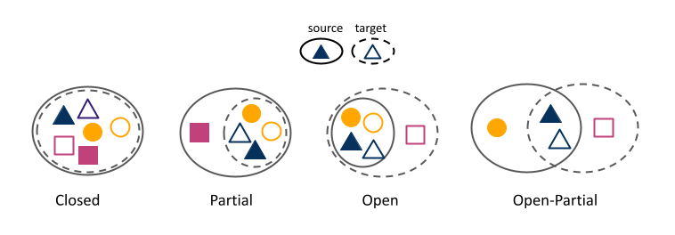
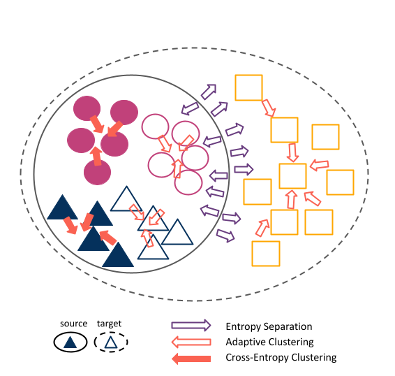

# DeepAstroUDA
We develop a Universal Domain Adaptation method DeepAstroUDA, capable of performing semi-supervised domain alignment that can be applied to datasets with different types of class overlap. Extra classes can be present in any of the two datasets, and the method can even be used in the presence of unknown classes. DeepAstroUDA can be used for classification, regression and anomaly detection. 

<div align="center">

  
<sub>Types of DA problems. Source domain is represented with solid line ellipse, while target domain uses dashed lines. Classes in the source domain are represented with filed shapes and target domain classes by empty shapes. In our work we focus on Open DA problems, but the code we develop is capable of handling all four types of DA problems.</sub>
</div>

## Table of Contents
1. [Intro and Experiments](#intro)
2. [Architecture](#architecture)
3. [Installation](#requirements)
4. [Pieces of the Package](#package-pieces)
5. [Inputs](#input)
6. [Outputs](#output)
7. [Using DeepAstroUDA](#deep-use)
8. [Commands and Optionals](#deep)
9. [Possible Experimental Setups](#setup)

### Intro and Experiments <a name="intro"></a>
In the era of big astronomical surveys, our ability to leverage artificial intelligence algorithms simultaneously for multiple datasets will open new avenues for scientific discovery. Unfortunately, simply training a deep neural network on images from one data domain often leads to very poor performance on any other dataset.
For the first time, we demonstrate the successful use of domain adaptation on two very different observational datasets (from SDSS and DECaLS). We show that our method is capable of bridging the gap between two astronomical surveys, and also performs well for anomaly detection and clustering of unknown data in the unlabeled dataset. We apply our model to two examples of galaxy morphology classification tasks with anomaly detection: 1) classifying spiral and elliptical galaxies with detection of merging galaxies (three classes including one unknown anomaly class); 2) a more granular problem where the classes describe more detailed morphological properties of galaxies, with the detection of gravitational lenses (ten classes including one unknown anomaly class).

### Architecture <a name="architecture"></a>
Our experiments were performed using a ResNet50 architecture, trained with early stopping that monitors the change in accuracy and stops the training when there is no improvement in 12 epochs. Domain-specific batch normalization is used to eliminates domain style information leakage. The model is trained using stochastic gradient descent with Nesterov momentum and an initial learning rate of 0.001. We train our models on 4 NVIDIA RTX A6000 GPUs (available from Google Colab and LambdaLabs), and on average the training converges in approximately 5 hours. 


<div align="center">

<br>
<br>
<br>
<sub>DeepAstroUDA method and the effects of different loss functions in an OpenDA problem. Cross-entropy loss (filled red arrows) clusters the labeled source domain data (filled circles and squares). Adaptive clustering loss (empty red arrows) pushes unlabeled target domain data (empty circles and squares), towards data it shares most similar features with (both source and target data, which are stored in the bank). Finally entropy loss (empty violet arrows) uses entropy to push away unknown classes further away from the known ones. In this Open DA example the unknown class is present in the target domain (empty squares.)</sub>
</div>
<br>
<br>
<br>
<br>

### Installation <a name="requirements"></a>
This code was developed using Pytorch. DeepAstroUDA has been packaged using PyPI, and can be pip installed much like a normal Python package:
```
pip install deepastrouda
```

### Pieces of the Package <a name="package-pieces"></a>

#### Input <a name="input"></a>

DeepAstroUDA includes access to the template files and sample datasets needed to run the system with varying amounts of input. Any sample datasets are automatically downloaded.

The available sample datasets (and their original use cases for this project) used are as follows:

| Dataset | Experimental Use |
|:---|:---|
| [Office-Home](https://www.hemanthdv.org/officeHomeDataset.html) | fast bench-marking and initial hyperparameter testing |
| [Astro-NN](https://astronn.readthedocs.io/en/latest/galaxy10.html) | subset of GalaxyZoo2 data (DECaLS data with cleaner class distinctions and 10 galaxy morphology classes) |
| [GalaxyZoo2](https://data.galaxyzoo.org) | GalazyZoo2 10-class data (SDSS wide field and Stripe 82 coadded-depth deep field)|
| [DeepAdversaries](https://zenodo.org/record/5514180#.Y2FkZC-B2_w) | Simulated LSST mocks after 1 and 10 years of observing (3 classes: spiral, elliptical, merging galaxy)|

Exact datasets (LSST mocks, SDSS wide and deep field and DeCALS data) we use in our work can be found on [Zenodoo](https://doi.org/10.5281/zenodo.7473597).

Along with the datasets above, an available configuration file template is available for new datasets. If a configuration file is not included at run-time, a configuration file of the same format will be output at the end of training.

#### Output<a name="output"></a>

The following are the metric documents output by the system:

- Loss CSV and plot
- Accuracy CSV and plots (total, closed, and per class accuracy)
- t-SNE plot and t-SNE visualization-tool file

## Using DeepAstroUDA <a name="deep-use"></a>

Below are the list of commands, along with some possible approaches to using DeepAstroUDA.

### DeepAstroUDA Available Commands and Optionals <a name="deep"></a>

| Command | Function |
|:---|:---|
| `deep_astro -h `| Displays a help prompt that gives a comprehensive overview of possible commands. |
| `deep_astro demo `| Automatically runs the DANCE pipeline on the Astro-NN dataset. | 
| `deep_astro demo -h` | Displays a help prompt that gives a cromprehensive overview of possible arguments and optionals. |
| `deep_astro --dataset={'office', 'astro-nn', 'gz2', 'deep-adv', 'data'}` | Runs a chosen example dataset with default training configuration. Use the **'data'** option if you're running deep_dance on your own dataset. |
| `deep_astro --config-path={path\to\referenced\file}` | Uses the provided path to get training configuration information from yaml. If file path not provided, a default training configuration yaml is created at the DEFAULT_PATH="./files/config_env/{dataset_name}-{num_classes}-train-config_{domain_type}. |
| `deep_astro --unknowns-supplied={Boolean}` | Not a required value. Informs program whether to use auto-clustering or conform to number of clusters specified in config file. If the variable is not provided, then the training will default to supplied based on data directory structure. |
| `deep_astro --image-path-text={path\to\referenced\file}` | Not a required value. Informs program whether an image directory to file path text file has been created. If optional is not supplied, a utility function will be called to create one. |
| `deep_astro --output-directory={path\to\referenced\directory}` | Not a required value. Informs program whether a desired output directory exists for training and testing output. If optional is not supplied, an output directory structure will be created. |
| `deep_astro --data-type={'jpg', 'png', 'numpy'}` | Not a required value. Informs program whether your personal dataset is in the form of jpeg, png, or .npy images/arrays. If optional is not supplied, program will (1) warn the user, and (2) infer the data type by peaking at the first data file available. |
| `deep_astro --domain-type={'open', 'open-partial', 'closed'}` | Allows user to choose what type of domain adaptation is being used ('open-partial' covers both partial and open-partial). If not supplied, **open** is the default. For comparison model trained without domain adaptation is also trained in parallel with any domain adaptation training.|
|`deep_astro run`| Run the full training and testing pipeline.|
|`deep_astro infer`| Run only the testing framework of the pipeline.|


### Possible Experimental Setups <a name="setups"></a>

To begin any example run of the DeepAstroUDA code, pip install the package using the following code:
`pip install deepastrouda`. Any required data will be automatically downloaded by the package. Please see the provided template `config.json` for a comprehensive look at what training, testing, and output parameters are available. 

|Example Scenarios|
|:---|
| [Run a Simple Example ](#example) |
| [Using Input Data + Default Training Configuration](#data-default) |
| [Using Input Data + Input Training Configuration](#data-config) |
| [Running a Containerized Setup](#container) | 


<!-- Checking links in paper [DeepAstroUDA Available Commands](#deep)
-- feature table with hyperlink to different approaches to using DeepAstroUDA -->

#### Approach 1: Run Minimal Example <a name="example"></a>

<!-- Explain that the chosen dataset demo is cross domain and adds extra noise -->
By default, the built-in demo example uses the Astro-NN DECaLS selection as its base dataset, with the source and target being randomly selected, evenly-split portions of the data. The source is the original input data with no modifications, and the target is the  input data with manually applied-noise. The dataset used can be changed for the demo. All datasets with the exception of DeepAdversaries will use the same setup of source and target being no-noise vs manually applied noise, respectively. The DeepAdversaries data will use its original Y1 and Y10 datasets.

Users should then configure their desired output paths and project environment path in their `config.json` file as follows:

```
{
  "path_to_ouput": "path/to/output/folder",
  "environment_path": "path/to/venv/in/use",
}
```

Lastly, begin the demo run using the command-line snippet below. All [output](#output) from both training and testing will be dumped in the output folder.

` deep_astro demo `

If you'd like to use another example dataset listed above, you can use the command-line optional below to specify which dataset to use.


For more help, run the following command-line code snippet:

` deep_astro demo -h`

#### Approach 2: Input Data + Default Training Configuration <a name="data-default"></a> 

Users should configure their desired output paths and project environment path in their `config.json` file as follows:

```
{
  "path_to_ouput": "path/to/output/folder",
  "environment_path": "path/to/venv/in/use",
}
```

To specify the use of your own dataset, use the following command:

`deep_astro --dataset=='data'`

To specify the path of your image dataset, run the following command:

`deep_astro --image-path-text={path\to\referenced\file}	`

If you provide a source and target, please ensure that the directory specified by your image path has the following structure:

    .
    ├── ...
    ├── image-directory                    # Your image data
    │   ├── source          # Your source dataset
    │   ├── target         # Your target dataset
    │   └── ...                
    └── ...

If you do not provide a source and target, but instead only an image directory without any data splits, your dataset will have a source and target structure applied automatically. This will be done by splitting the data in half and manually adding noise to the created target dataset. 


If you are already aware of the number of unknown classes in your dataset, please specify in your `config.json` and use the appropriate command. For example, if you supply the unknown classes, you would have the following parameters set in your configuration file:

```
{
  "num_unknowns": "3",
}
```

And run the command: 
`deep_astro --unknowns-supplied=True`

To run the full training and testing pipeline on your data, finally, run the following command:

```
deep_astro run
```

If you're only interested in running the test pipeline on your data, you can run the following instead:

```
deep_astro infer
```

#### Approach 3: Input Data + Input Training Configuration File <a name="data-config"></a> 
Users should configure their desired output paths and project environment path in their `config.json` file as follows:

```
{
  "path_to_ouput": "path/to/output/folder",
  "environment_path": "path/to/venv/in/use",
}
```

To specify the use of your own dataset, use the following command:

`deep_astro --dataset=='data'`

To specify the path of your image dataset, run the following command:

`deep_astro --image-path-text={path\to\referenced\file}	`

If you provide a source and target, please ensure that the directory specified by your image path has the following structure:

    .
    ├── ...
    ├── image-directory                    # Your image data
    │   ├── source          # Your source dataset
    │   ├── target         # Your target dataset
    │   └── ...                
    └── ...

If you do not provide a source and target, but instead only an image directory without any data splits, your dataset will have a source and target structure applied automatically. This will be done by splitting the data in half and manually adding noise to the created target dataset. 


If you are already aware of the number of unknown classes in your dataset, please specify in your `config.json` and use the appropriate command. For example, if you supply the unknown classes, you would have the following parameters set in your configuration file:

```
{
  "num_unknowns": "3",
}
```

And run the command: 
`deep_astro --unknowns-supplied=True`

To change initial values for parameters that impact testing or training, such as batch size, weight decay, or the learning rate, change the value of these variables `config.json` file. For instance, if I wanted to change the learning rate to 0.001, the base model to resnet16, and weight decay to 0.05, the relevant portion of my `config.json` would look as follows: 

```
model:
  base_model: 'resnet16'
...
train:
  learning_rate: 0.001
  weight_decay: 0.05
```

To run the full training and testing pipeline on your data, finally, run the following command:

```
deep_astro run
```

After training on your data, if you'd like to run tests on your data again using your personally trained model, use the following:

```
deep_astro infer
```

#### Approach 4: Running a Containerized Setup <a name="container"></a>

A Docker MAKEFILE is also available for training and inference. The Docker files associated with this project can be used like any other Docker file, where one must first build the image and then run the inference. As a short example of how this done, if you would like to build the Docker image with your custom configurations, run the following:

 ```
 docker build -t deep-astro-uda -f Dockerfile .
 ```
 All optionals and arguments that are provided by Docker for configuring the `build` command are also available.
 
 An example test run using the previously created docker build would look as follows:
 ```
docker run --rm -it -e src=$PWD,dst=/deep_astro deep_astro infer.py
 ```
 
 All optionals and arguments that are provided by Docker for configuring the `run` command are also available.

### Authors
- Ashia Lewis
- Aleksandra Ćiprijanović

### References
If you use this code, please cite our paper: [arXiv:2302.02005](https://arxiv.org/abs/2302.02005), [arXiv:2211.00677](https://arxiv.org/abs/2211.00677)
